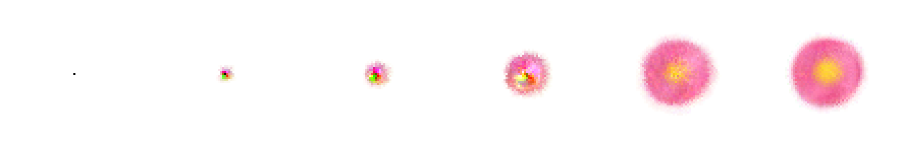
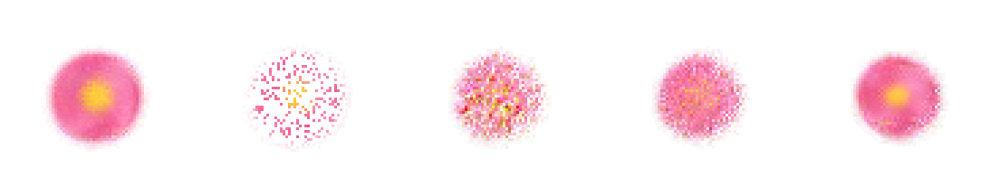
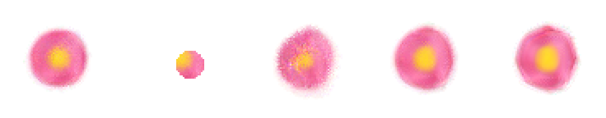
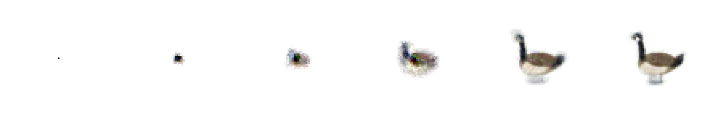

# Self-Organizing Morphogenesis Engine

**Neural Cellular Automata that grow images from a single seed and regrow them after you destroy 80% of the cells.**

A PyTorch implementation of differentiable morphogenesis, built as a
configurable simulation engine: multiple targets, pluggable damage models,
an interactive damage/regeneration demo, a reproducible evaluation
protocol, and a test suite that asserts the headline numbers.

Every cell in a 128×128 grid (**16,384 cells**) runs the *same* tiny
network (8,320 parameters, the organism's "genome"). No cell knows where it
is or sees the global picture; each one only perceives its 3×3 neighborhood.
Global structure (growth, shape, self-repair) **emerges** from purely local
communication, exactly the property that makes biological morphogenesis
interesting.

## Results

<!-- RESULTS:BEGIN -->
Measured on the shipped `checkpoints/flower.pt` (10 independent trials per
protocol, seeded; full report in `results/eval_flower.json`, regenerated by
`python -m morphogenesis eval`):

| protocol | SSIM vs. target (mean) | min over 10 trials |
|---|---|---|
| grow from a **single seed** (96 steps) | **0.965** | 0.960 |
| destroy **80% of living cells at random** → 200 recovery steps | **0.960** | 0.955 |
| destroy 80%, **one contiguous ~20% fragment survives** → 300 steps | **0.950** | 0.927 |

All three protocols clear **0.90 SSIM** on every trial, asserted by
`tests/test_claims.py`, so `pytest` reproduces every number in this table.
Simulation grid: 128×128 = **16,384 cells**; update rule: **8,320
parameters**; SSIM: scikit-image reference implementation over the full
canvas.

**Growth**: one living cell → the target (steps 0, 8, 16, 32, 64, 96):



**Regeneration**: 80% of cells destroyed at random, then self-repair
(grown → damaged → +25 → +60 → +200 steps):



**Fragment regeneration**: everything wiped except one ~20% fragment
(grown → fragment → +40 → +120 → +300 steps):



**Second trained target, same engine**: `checkpoints/goose.pt`
(`results/eval_goose.json`: growth 0.988, 80% random destruction 0.992,
fragment-only 0.981 mean SSIM over 5 trials):


<!-- RESULTS:END -->

## How it works

Each cell holds a 16-channel state vector: channels 0–3 are visible RGBA
(alpha doubles as the "alive" signal), the other 12 are hidden channels the
cells use as chemical signals. One simulation step:

1. **Perception**: each cell concatenates its state with Sobel-x / Sobel-y
   estimates of the local state gradient (fixed kernels, not learned):
   16 → 48 features.
2. **Update rule**: a per-cell MLP (two 1×1 convolutions, 48 → 128 → 16)
   produces a state delta. The last layer is zero-initialized, so the
   untrained CA is the identity map.
3. **Stochastic firing**: each cell applies its delta with probability 0.5,
   breaking global synchrony (no central clock).
4. **Alive masking**: cells with no mature neighbor (alpha > 0.1 in their
   3×3 neighborhood) are zeroed, so tissue can only grow outward from
   living tissue.

### Why it can regenerate

Training uses a **persistent sample pool** with a **damage curriculum**
(`morphogenesis/training.py`): batches are drawn from a pool of previously
grown states, the worst sample is reset to a seed (growth is never
forgotten), and the best samples are damaged before training with circular
blasts plus a severe variant that wipes everything but a ~20% fragment.
The CA is therefore explicitly trained to treat *any* damaged configuration
as something to repair back to the target attractor.

Because the update rule is translation-invariant, training runs on a cropped
72×72 grid (the pattern plus padding) and the trained rule transfers
unchanged to the full 128×128 simulation grid.

## Quickstart

```bash
python -m venv .venv && source .venv/bin/activate
pip install -e ".[dev]"

# grow the pre-trained flower from one seed cell
python -m morphogenesis grow --checkpoint checkpoints/flower.pt --gif out/grow.gif

# destroy 80% of the cells, watch it regenerate
python -m morphogenesis regen --checkpoint checkpoints/flower.pt --destroy 0.8 --gif out/regen.gif

# same, but leave only ONE contiguous fragment (20% of the pattern)
python -m morphogenesis regen --checkpoint checkpoints/flower.pt --destroy 0.8 --fragment

# interactive: click to blast holes, press D for 80% destruction, F for fragment
python -m morphogenesis demo --checkpoint checkpoints/flower.pt

# full evaluation protocol (the numbers above)
python -m morphogenesis eval --checkpoint checkpoints/flower.pt --trials 10

# run the test suite, including the claim tests
pytest
```

### Interactive demo controls

| input | effect |
|---|---|
| click / drag | blast a hole where you point |
| `D` | destroy 80% of living cells at random |
| `F` | wipe everything except one ~20% fragment |
| `R` | reset to a single seed |
| `space` | pause / resume |

## Train your own

Ten built-in procedural targets, no downloaded assets, everything is drawn
in code (`morphogenesis/targets.py`):


`goose` (a University of Waterloo campus goose), `flower`, `lizard`,
`heart`, `ring`, `butterfly`, `fish`, `maple_leaf`, `mushroom`, `star`.
Or any RGBA image of your own:

```bash
python -m morphogenesis train --config configs/flower.yaml
python -m morphogenesis train --config configs/flower.yaml --target goose
python -m morphogenesis train --config configs/flower.yaml --target path/to/emoji.png
```

Everything about an experiment (grid size, channels, fire rate, pool size,
damage curriculum, learning-rate schedule) lives in one YAML file
(`configs/*.yaml`, schema in `morphogenesis/config.py`).

## Evaluation protocol

`python -m morphogenesis eval` measures, over N independent trials
(`morphogenesis/evaluate.py`):

1. **Growth**: 96 steps from a single seed → SSIM vs. target.
2. **Random 80% destruction**: kill 80% of living cells uniformly at
   random, 200 recovery steps → SSIM.
3. **Fragment regeneration**: keep only one contiguous fragment holding
   ~20% of living cells, 300 recovery steps → SSIM.

SSIM is scikit-image's reference implementation (Wang et al. 2004), computed
over the full 128×128 canvas rendered on white. `tests/test_claims.py`
asserts SSIM ≥ 0.90 for all three protocols across seeded trials, so
`pytest` is the receipt for every number in this README.

## Project layout

```
morphogenesis/
  model.py        # the NCA update rule (perception, MLP, firing, alive mask)
  training.py     # pool training + damage curriculum
  simulation.py   # stateful engine: step/damage/measure, checkpoint loading
  targets.py      # procedural RGBA targets + custom image loading
  evaluate.py     # the evaluation protocol behind the headline numbers
  metrics.py      # SSIM / MSE against targets
  interactive.py  # matplotlib click-to-damage live demo
  config.py       # experiment schema (YAML)
  cli.py          # train / grow / regen / eval / demo / targets
configs/          # experiment configs
checkpoints/      # trained weights (33 KB each, the whole organism)
tests/            # unit tests + claim tests (pytest)
```
